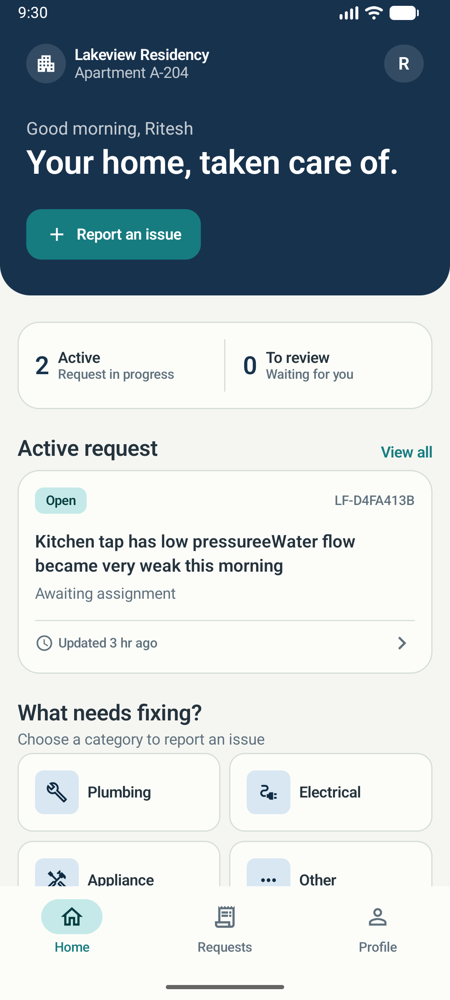
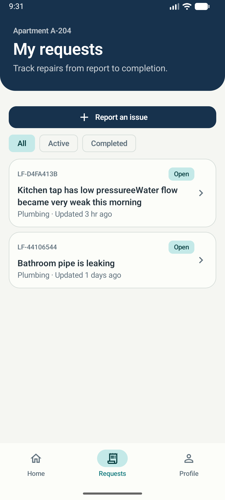
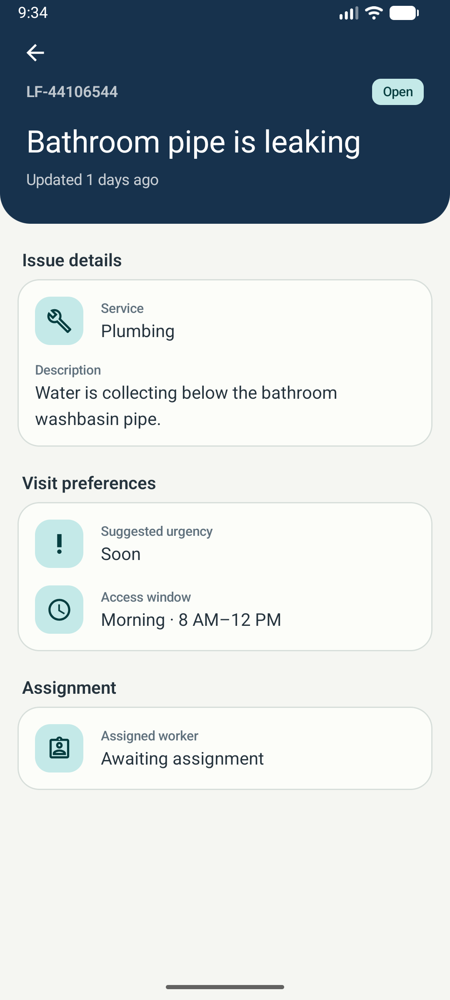
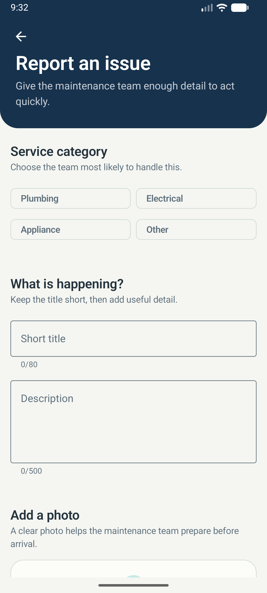
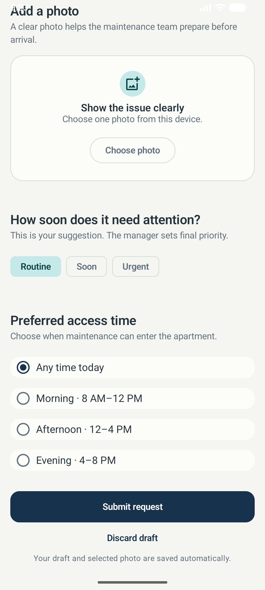
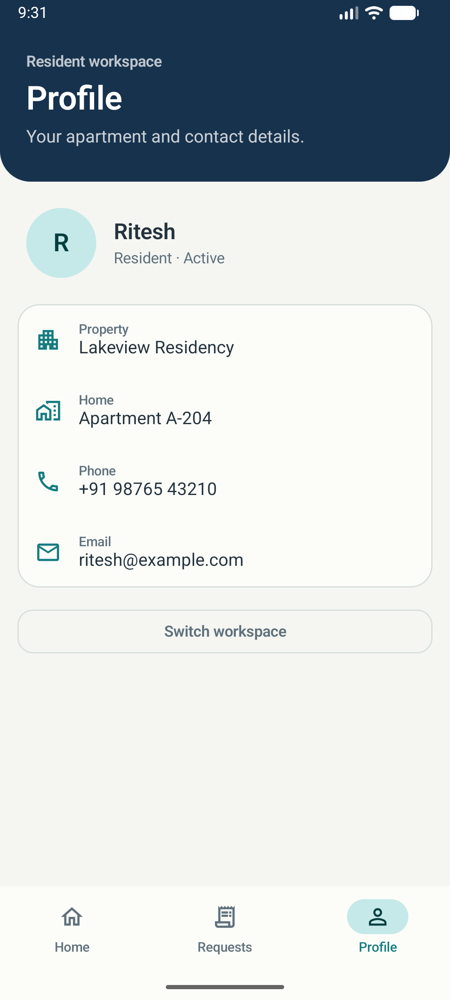
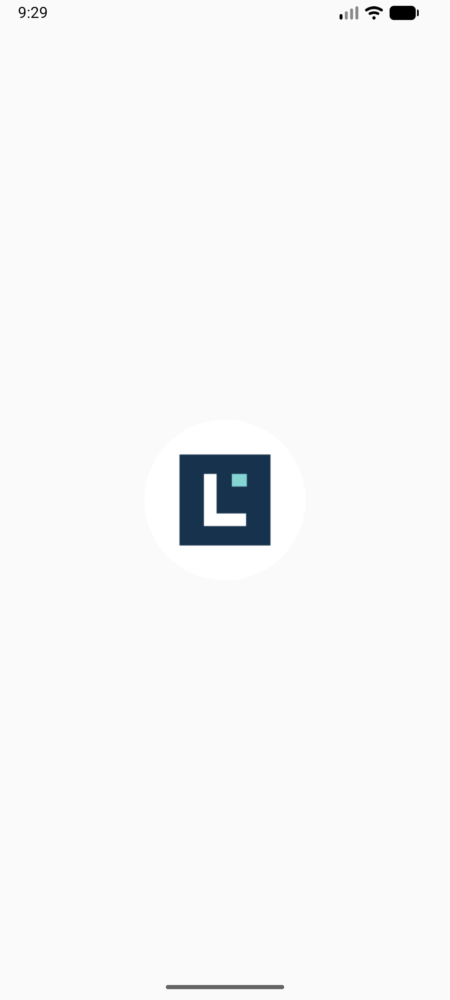

# LocalFix

LocalFix is an Android app for reporting and tracking maintenance problems in apartment buildings. It comes from a real problem I faced, and I could not find a simple local app built around this exact workflow.

I started this project because of a problem I have seen in my own apartment. Most maintenance complaints are shared through phone calls, chat messages, or in-person conversations. It becomes difficult to know who is handling an issue, whether any progress has been made, or if the complaint was forgotten completely.

My plan is to first use LocalFix in my apartment and improve it based on feedback from actual residents and maintenance workers. Once it works well there, I want to test it in **10 more apartment communities** before thinking about scaling it further.

> **Current status:** The resident side is working from the Android app to the backend and database. The manager and maintenance-worker sides are still to be built.

## Resident experience

<table>
  <tr>
    <td align="center"><br><strong>Resident home</strong></td>
    <td align="center"><br><strong>Request tracking</strong></td>
    <td align="center"><br><strong>Request details</strong></td>
  </tr>
  <tr>
    <td align="center"><br><strong>Issue details</strong></td>
    <td align="center"><br><strong>Visit preferences</strong></td>
    <td align="center"><br><strong>Resident profile</strong></td>
  </tr>
  <tr>
    <td colspan="3" align="center"><br><strong>Launch experience</strong></td>
  </tr>
</table>

## What is working

- Residents can create a request with a category, title, description, urgency, preferred visit time, and a photo.
- Unfinished requests are saved in Room, so the draft is still there after closing or restarting the app.
- Requests are sent from the Android app to the FastAPI backend and saved in a SQL database.
- Residents can see all their requests, filter them, and open a request to view its details.
- Retrying a failed submission does not create the same request twice.
- The app has proper loading, empty, error, and retry states for backend calls.
- Pydantic validates incoming API data, while domain rules control which ticket status changes are allowed.

## Architecture

```text
Jetpack Compose UI
        │
ViewModel + StateFlow
        │
Resident Repository ───── Room (durable local drafts)
        │
      JSON API
        │
FastAPI → Service layer → SQLAlchemy → SQLite / PostgreSQL
```

I am building the project one complete flow at a time. For example, the resident request flow was connected from the Compose screen all the way to the database before starting the manager flow. This makes it easier to test each part in the actual app instead of building the entire backend or UI separately.

## Tech stack

| Area | Technologies |
| --- | --- |
| Android | Kotlin, Jetpack Compose, Material 3, Navigation Compose, Coroutines, StateFlow |
| Local data | Room, schema migrations, Android Photo Picker, Coil |
| Backend | Python, FastAPI, Pydantic, Uvicorn |
| Persistence | SQLAlchemy, Alembic, SQLite for local development, PostgreSQL-ready configuration |
| Testing | JUnit, Compose UI tests, Room migration tests, FastAPI TestClient, Ruff, Android Lint |

## Run locally

### Backend

Python 3 and a virtual environment are required.

```shell
cd backend
python3 -m venv .venv
.venv/bin/python -m pip install -r requirements-dev.txt
.venv/bin/alembic upgrade head
.venv/bin/uvicorn app.main:app --reload
```

The API runs at `http://127.0.0.1:8000`; interactive API documentation is available at `http://127.0.0.1:8000/docs`.

### Android

1. Open the `android` directory in Android Studio.
2. Start an Android emulator running API 26 or newer.
3. Run the `app` configuration.

The debug build is already configured to reach the backend from the Android emulator at `http://10.0.2.2:8000`.

## Current scope

LocalFix is being built for the maintenance team already working in an apartment; it is not a marketplace for finding outside service providers. The current app uses fixed resident and apartment data while the main workflow is being built. Selected photos are saved with the local draft but are not uploaded to the backend yet. SQLite keeps local development simple, with PostgreSQL planned for deployment.
